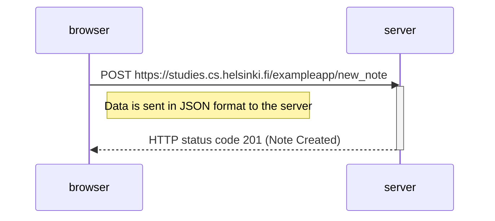

```mermaid
sequenceDiagram
    participant browser
    participant server

    browser->>server: POST https://studies.cs.helsinki.fi/exampleapp/new_note
    activate server

    Note right of browser: Data is sent in JSON format to the server

    server-->>browser: HTTP status code 201 (Note Created)
    deactivate server

```
